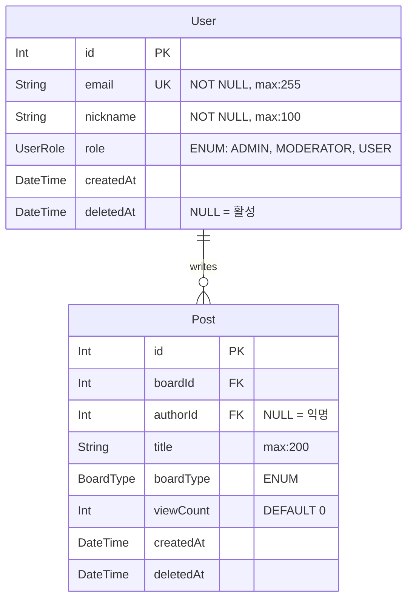
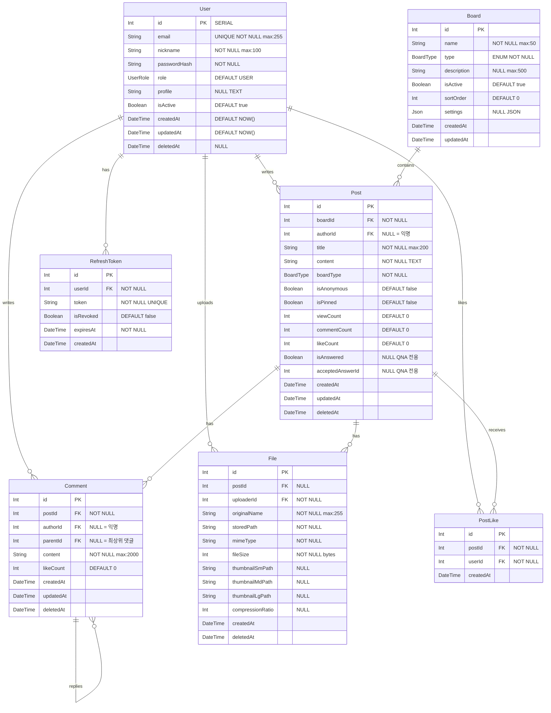
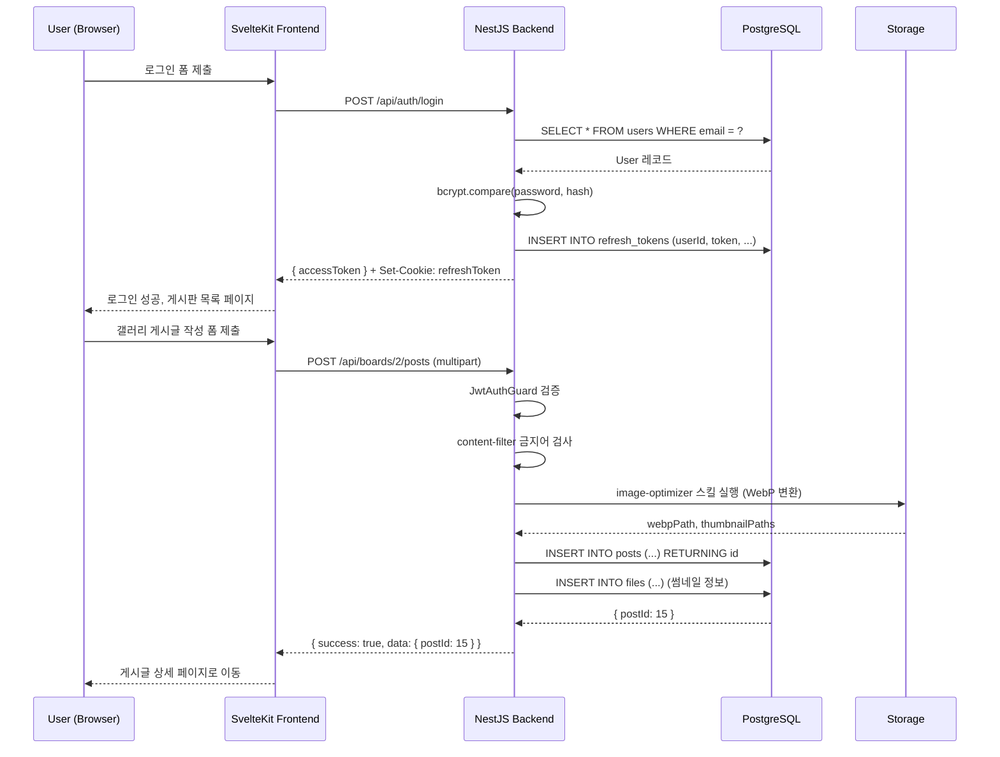

# 11. 에이전트 친화적 분석/설계서 작성법 — ERD · API 명세 · 유스케이스 완성

> **학습 목표**
> - 에이전트가 설계서를 파싱하는 방식을 이해한다
> - Mermaid erDiagram으로 BoardHub 전체 ERD를 작성한다
> - 에이전트 친화적 API 명세서를 JSON 스키마와 함께 작성한다
> - 유스케이스 명세서와 시퀀스 다이어그램을 작성한다
> - docs/ 폴더 구조 표준과 INDEX.md 인덱스 파일 작성법을 익힌다

---

## 1. 에이전트가 설계서를 파싱하는 방식

### 1.1 에이전트의 문서 이해 과정

에이전트는 설계서를 단순히 "읽는" 것이 아니라 구조화된 정보로 파싱한다.

```
설계서 처리 파이프라인:

원문 Markdown 파일
        |
        v
AST 파싱 (헤더, 테이블, 코드블록 구조 추출)
        |
        v
시맨틱 청킹 (섹션별 의미 단위 분리)
        |
        v
코드블록 언어 감지 (mermaid, json, typescript 등)
        |
        v
Mermaid 다이어그램: 구조화된 관계 데이터
JSON 스키마: 타입 정보 및 제약조건
TypeScript 인터페이스: 타입 힌트
        |
        v
에이전트 컨텍스트에 구조화된 형태로 주입
        |
        v
정확한 코드 생성 (추측 없음)
```

### 1.2 잘 작성된 설계서 vs 잘못 작성된 설계서

**잘못된 예 (에이전트가 오해하기 쉬움):**
```
users 테이블은 id, 이름, 이메일 등을 가지고 있습니다.
posts 테이블은 users와 연결되어 있습니다.
```

**올바른 예 (에이전트가 정확히 파싱):**


---

## 2. ERD 작성 — BoardHub 전체 데이터 모델

### 2.1 Mermaid ERD 완성본



### 2.2 Enum 정의

```typescript
// 모든 Enum 정의를 한 곳에 문서화
enum UserRole {
  ADMIN      // 전체 관리 권한
  MODERATOR  // 게시판 관리 권한
  USER       // 일반 사용자
}

enum BoardType {
  GENERAL    // 일반 게시판 (기본 텍스트)
  GALLERY    // 갤러리 게시판 (이미지 필수)
  VIDEO      // 동영상 게시판 (동영상 필수)
  QNA        // Q&A 게시판 (답변 채택 기능)
  NOTICE     // 공지 게시판 (MODERATOR 이상 작성)
  FAQ        // FAQ 게시판 (카테고리 분류)
  PRIVATE    // 비공개 문의 (작성자+ADMIN만 열람)
  FREE       // 자유 게시판 (익명 허용)
}
```

---

## 3. API 명세서 작성

### 3.1 API 명세서 작성 원칙

에이전트가 API 명세를 읽고 NestJS 컨트롤러를 정확히 구현하려면 다음이 필요하다:

1. HTTP 메서드 + 경로
2. 요청 헤더 (인증 방식)
3. 요청 바디/쿼리 JSON 스키마
4. 응답 JSON 스키마
5. 가능한 HTTP 오류 코드

### 3.2 인증 API 명세

```markdown
## Auth API

### POST /api/auth/register — 회원 가입

**Request Body**:
```json
{
  "email": "user@example.com",
  "password": "Str0ng!Pass",
  "nickname": "홍길동"
}
```

**Response 201**:
```json
{
  "success": true,
  "data": {
    "userId": 1,
    "email": "user@example.com",
    "nickname": "홍길동",
    "role": "USER",
    "createdAt": "2026-06-01T00:00:00Z"
  }
}
```

**Errors**:
- 400: 유효성 검증 실패 `{ "success": false, "code": "VALIDATION_ERROR", "message": "...", "statusCode": 400 }`
- 409: 이메일 중복 `{ "success": false, "code": "EMAIL_DUPLICATE", "message": "이미 사용 중인 이메일입니다", "statusCode": 409 }`

---

### POST /api/auth/login — 로그인

**Request Body**:
```json
{
  "email": "user@example.com",
  "password": "Str0ng!Pass"
}
```

**Response 200**:
```json
{
  "success": true,
  "data": {
    "accessToken": "eyJhbGci...",
    "user": {
      "id": 1,
      "email": "user@example.com",
      "nickname": "홍길동",
      "role": "USER"
    }
  }
}
```
**Set-Cookie**: `refreshToken=eyJhbGci...; HttpOnly; Secure; SameSite=Strict; Max-Age=604800`

---

### POST /api/auth/refresh — 토큰 갱신

**Request**: Cookie에서 refreshToken 자동 추출 (별도 바디 없음)
**Response 200**:
```json
{
  "success": true,
  "data": {
    "accessToken": "eyJhbGci..."
  }
}
```

---

### POST /api/auth/logout — 로그아웃

**Request Header**: `Authorization: Bearer {accessToken}`
**Response 200**:
```json
{ "success": true, "data": null }
```
**Set-Cookie**: `refreshToken=; Max-Age=0` (쿠키 삭제)
```

### 3.3 게시글 API 명세

```markdown
## Posts API

### GET /api/boards/:boardId/posts — 게시글 목록

**Query Parameters**:
```json
{
  "page": 1,
  "limit": 20,
  "search": "검색어",
  "sort": "latest|popular|views"
}
```

**Response 200**:
```json
{
  "success": true,
  "data": [
    {
      "id": 1,
      "boardId": 2,
      "title": "게시글 제목",
      "boardType": "GALLERY",
      "isAnonymous": false,
      "author": {
        "id": 5,
        "nickname": "홍길동"
      },
      "viewCount": 142,
      "commentCount": 7,
      "likeCount": 23,
      "thumbnailPath": "/uploads/post1/thumb_sm.webp",
      "createdAt": "2026-06-01T10:30:00Z"
    }
  ],
  "meta": {
    "total": 1543,
    "page": 1,
    "limit": 20,
    "totalPages": 78,
    "hasNext": true,
    "hasPrev": false
  }
}
```

---

### POST /api/boards/:boardId/posts — 게시글 작성

**Request Header**: `Authorization: Bearer {accessToken}`
**Content-Type**: `multipart/form-data` (파일 포함 시) 또는 `application/json`

**Request Body (multipart)**:
```
title: "게시글 제목"
content: "<p>HTML 내용</p>"
isAnonymous: false
files: [이미지 파일 1..10] (GALLERY 타입 필수)
```

**Response 201**:
```json
{
  "success": true,
  "data": {
    "postId": 15,
    "boardType": "GALLERY",
    "createdAt": "2026-06-01T10:30:00Z"
  }
}
```

**Errors**:
- 400: 갤러리 타입에 이미지 없음 `{ "code": "IMAGE_REQUIRED" }`
- 400: 파일 크기 초과 `{ "code": "FILE_TOO_LARGE" }`
- 403: 공지 게시판에 USER 역할로 작성 시도
```

---

## 4. 유스케이스 명세서

### 4.1 유스케이스 명세 형식

```markdown
## UC-001 갤러리 게시글 작성

**액터**: 인증된 User
**목표**: 갤러리 게시판에 이미지가 포함된 게시글을 작성한다
**선행 조건**: 로그인 상태, 갤러리 타입 게시판 존재

**정상 흐름**:
1. User가 갤러리 게시판 글쓰기 버튼 클릭
2. 시스템이 글쓰기 폼 표시
3. User가 제목, 내용 입력
4. User가 이미지 파일 1~10개 첨부
5. User가 등록 버튼 클릭
6. 시스템이 content-filter로 금지어 검사
7. 시스템이 image-optimizer로 이미지 WebP 변환
8. 시스템이 썸네일 3종 생성 (150x150, 640x480, 1280x960)
9. 시스템이 게시글 DB 저장
10. 시스템이 게시글 상세 페이지로 리디렉트

**대안 흐름**:
6a. 금지어 감지
  → 경고 메시지 표시, 제출 차단
4a. 이미지 없이 제출
  → "갤러리 게시판은 이미지 필수" 오류
4b. 이미지 크기 초과 (5MB+)
  → "최대 5MB" 오류
4c. 지원하지 않는 형식
  → "JPEG, PNG, GIF만 지원" 오류

**후행 조건**: 새 게시글이 DB에 저장, 이미지가 WebP로 변환 저장
```

### 4.2 로그인-게시글 작성 시퀀스 다이어그램



---

## 5. docs/ 폴더 구조 표준

### 5.1 표준 문서 폴더 구조

```
boardhub/
├── docs/
│   ├── INDEX.md              (문서 인덱스 — 에이전트 진입점)
│   ├── PRD.md                (제품 요구사항 문서)
│   ├── architecture/
│   │   ├── ERD.md            (데이터 모델 — Mermaid ERD)
│   │   ├── system-design.md  (시스템 아키텍처 다이어그램)
│   │   └── tech-stack.md     (기술 스택 선택 이유)
│   ├── api/
│   │   ├── auth.md           (인증 API 명세)
│   │   ├── users.md          (사용자 API 명세)
│   │   ├── boards.md         (게시판 API 명세)
│   │   ├── posts.md          (게시글 API 명세)
│   │   ├── comments.md       (댓글 API 명세)
│   │   └── files.md          (파일 API 명세)
│   └── usecases/
│       ├── auth-flow.md      (인증 플로우 유스케이스)
│       ├── board-flow.md     (게시판 플로우 유스케이스)
│       └── post-flow.md      (게시글 플로우 유스케이스)
```

### 5.2 INDEX.md 작성법

INDEX.md는 에이전트가 문서 구조를 파악하는 진입점이다.

```markdown
# BoardHub 문서 인덱스

## 빠른 참조

| 문서 | 내용 | 에이전트 활용 목적 *(AGENTS.md 사용 권장)* <!-- R3 수정 --> |
|------|------|-----------------|
| PRD.md | 제품 요구사항 | 구현 범위와 제약 파악 |
| architecture/ERD.md | 데이터 모델 | DB 스키마 이해 |
| api/posts.md | 게시글 API | PostsController 구현 |
| usecases/post-flow.md | 게시글 시나리오 | 비즈니스 로직 파악 |

## 구현 순서

에이전트가 BoardHub를 구현할 때 권장하는 문서 읽기 순서:

1. docs/PRD.md — 전체 범위 파악
2. docs/architecture/ERD.md — 데이터 모델 이해
3. docs/api/[모듈].md — 구현할 모듈의 API 명세
4. docs/usecases/[플로우].md — 비즈니스 로직 확인

## 주요 개념 색인

- 소프트 딜리트: PRD.md §7 + ERD.md (deletedAt 필드)
- JWT 인증: api/auth.md + usecases/auth-flow.md
- 파일 업로드: api/files.md + PRD.md §FR-050
- 게시판 유형별 처리: PRD.md §4, ERD.md (BoardType Enum)
```

---

## 6. 에이전트가 설계서를 활용하는 방법

설계서 작성 완료 후 에이전트에게 지시하는 방법:

```bash
# 전체 설계서를 인덱스 기반으로 참조
agy agent run "docs/INDEX.md를 먼저 읽고,
              docs/api/posts.md 명세에 따라
              PostsController와 PostsService를 완전히 구현해줘.
              ERD.md의 Post 모델을 참고하고
              GEMINI.md의 모든 규칙을 준수해줘" @docs/

# 특정 문서 직접 참조
/code "이 ERD를 Prisma 스키마로 변환해줘. 모든 관계(relation)와
       인덱스를 포함하고, @map 데코레이터로 snake_case 컬럼명을 사용해줘"
      @docs/architecture/ERD.md
```

---

## 7. 설계서 완성도 체크리스트

```
ERD 체크리스트:
[ ] 모든 테이블(모델)이 정의됨
[ ] 모든 필드의 타입과 제약조건이 명시됨 (NOT NULL, UNIQUE, DEFAULT 등)
[ ] PK, FK 관계가 명확히 표시됨
[ ] Enum 타입이 정의됨
[ ] 소프트 딜리트 필드(deletedAt)가 해당 테이블에 포함됨
[ ] 인덱스가 필요한 필드가 표시됨 (email UNIQUE, boardId FK 등)

API 명세 체크리스트:
[ ] 모든 엔드포인트의 HTTP 메서드와 경로가 정의됨
[ ] 인증 필요 여부가 명시됨 (Bearer 토큰)
[ ] 요청 바디/쿼리 파라미터의 JSON 스키마가 있음
[ ] 정상 응답의 JSON 스키마가 있음
[ ] 모든 오류 케이스가 HTTP 상태 코드와 오류 코드로 정의됨
[ ] 파일 업로드 API의 Content-Type이 명시됨 (multipart/form-data)

유스케이스 체크리스트:
[ ] 주요 기능별 유스케이스가 작성됨
[ ] 정상 흐름과 대안 흐름이 구분됨
[ ] 선행 조건과 후행 조건이 명시됨
[ ] 시퀀스 다이어그램이 포함됨

폴더 구조:
[ ] docs/ 폴더에 표준 구조로 문서가 정리됨
[ ] INDEX.md가 작성됨
[ ] 에이전트 활용 목적 *(AGENTS.md 사용 권장)* <!-- R3 수정 -->이 INDEX.md에 명시됨
```

---

## 체크리스트

이 편을 완료한 후 다음을 확인한다:

- [ ] 에이전트가 설계서를 파싱하는 AST 처리 과정을 이해했다
- [ ] BoardHub 전체 ERD를 Mermaid erDiagram으로 작성했다
- [ ] 인증 API와 게시글 API 명세서를 JSON 스키마와 함께 작성했다
- [ ] UC-001 갤러리 게시글 작성 유스케이스를 완성했다
- [ ] 시퀀스 다이어그램을 Mermaid로 작성했다
- [ ] docs/ 폴더를 표준 구조로 생성하고 INDEX.md를 작성했다
- [ ] 설계서 완성도 체크리스트를 모두 통과했다

---

> **한줄 요약**
> 에이전트 친화적 설계서는 Mermaid ERD(데이터 모델), JSON 스키마 기반 API 명세, 유스케이스 다이어그램을 docs/INDEX.md 중심으로 구조화하여 에이전트가 추측 없이 정확한 코드를 생성할 수 있는 완전한 설계 기반을 제공한다.
