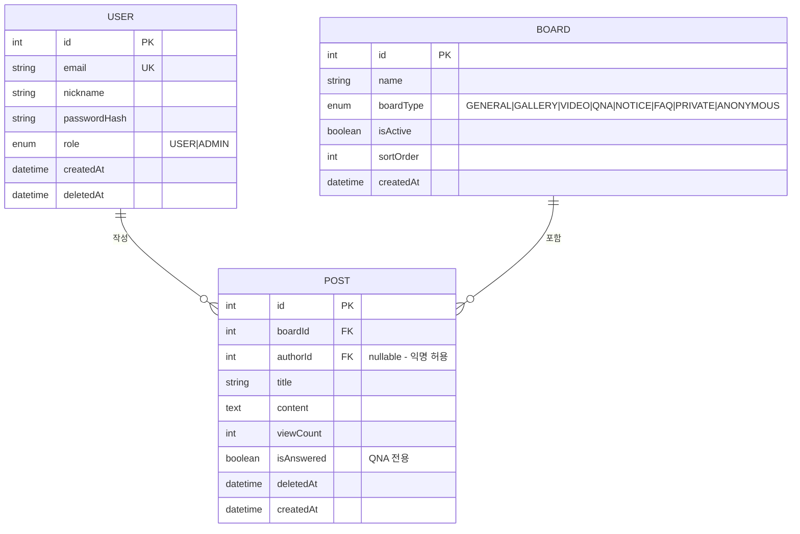
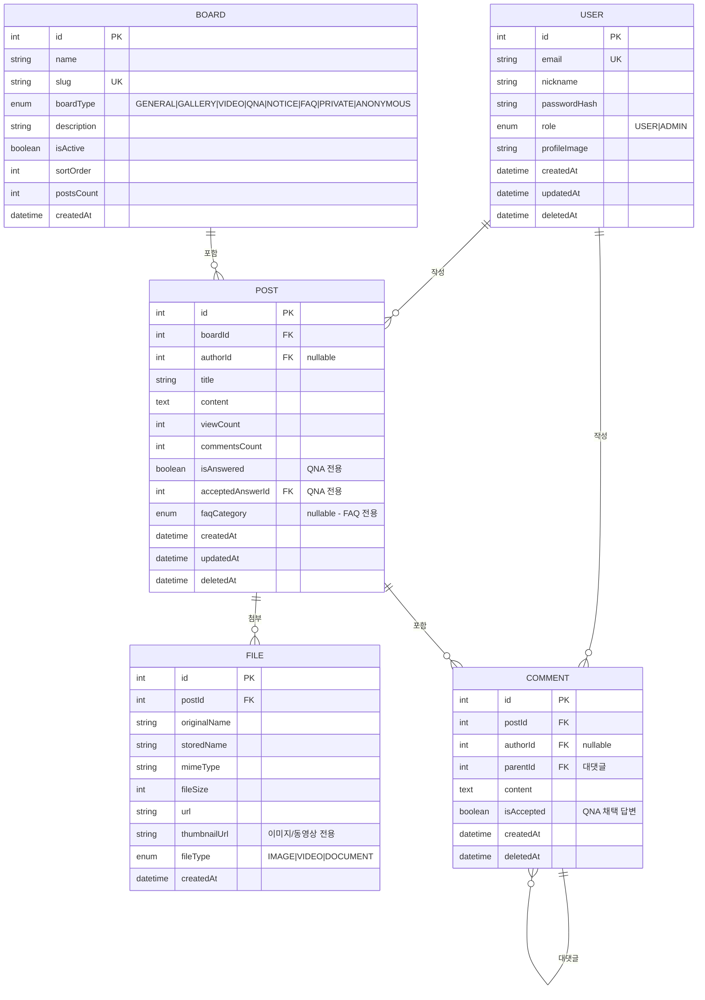

> **R6 수정**: @must/@avoid 어노테이션 삭제. Mermaid ERD 지원 공식 확인 내용 유지. 일반 Markdown 규칙 방식으로 설명 수정. 핵심 설계서 작성 워크플로우 유지.

# 11. 에이전트 친화적 분석설계서 작성법 — ERD에서 API 명세까지

> **학습 목표**
> - 에이전트가 직접 파싱할 수 있는 ERD 형식을 작성한다
> - Mermaid 다이어그램을 사용하여 시각적 설계서를 만든다
> - API 명세서를 에이전트 친화적 형식으로 작성한다
> - BoardHub의 완전한 ERD + API 명세서를 완성한다

---

## 1. 에이전트 친화적 설계서의 특징

에이전트는 Markdown과 Mermaid 다이어그램을 직접 파싱한다. 따라서 설계서를 Markdown + Mermaid로 작성하면 에이전트가 설계를 이해하고 코드를 생성하는 정확도가 크게 높아진다.

---

## 2. Mermaid ERD 작성법

### 2.1 기본 ERD 구조



### 2.2 에이전트에게 ERD 기반 코드 생성 요청

```
/code "이 ERD를 기반으로 Prisma 스키마를 작성해줘.
  소프트 딜리트(deletedAt) 포함, 모든 관계 설정 포함"
  @docs/erd.md
```

Antigravity IDE는 Mermaid ERD를 시각적으로 렌더링하며 에이전트가 이를 파싱한다.

---

## 3. BoardHub 완전 ERD



---

## 4. API 명세서 작성법

### 4.1 에이전트 친화적 API 명세 형식

```markdown
## POST /api/boards/:boardId/posts

**설명**: 새 게시글 작성

**인증**: Bearer JWT (role: USER 이상)

**Path Parameters**:
| 이름 | 타입 | 필수 | 설명 |
|------|------|------|------|
| boardId | integer | Y | 게시판 ID |

**Request Body** (multipart/form-data):
| 이름 | 타입 | 필수 | 제약 |
|------|------|------|------|
| title | string | Y | 1~200자 |
| content | string | N | HTML, 최대 50,000자 |
| images | File[] | 조건부 | GALLERY 타입 필수, 최대 10개, 각 5MB |
| video | File | 조건부 | VIDEO 타입 필수, 최대 100MB |

**Response 201**:
```json
{
  "success": true,
  "data": {
    "id": 42,
    "title": "첫 번째 갤러리 게시글",
    "boardType": "GALLERY",
    "images": [
      { "url": "/uploads/img_001.webp", "thumbnailUrl": "/uploads/thumb_001.webp" }
    ],
    "createdAt": "2026-06-01T09:00:00.000Z"
  }
}
```

**오류 응답**:
| 상태 코드 | code | 설명 |
|---------|------|------|
| 400 | VALIDATION_FAILED | 유효성 검증 실패 |
| 401 | UNAUTHORIZED | 인증 필요 |
| 404 | BOARD_NOT_FOUND | 게시판 없음 |
| 413 | FILE_TOO_LARGE | 파일 크기 초과 |
```

---

## 5. 설계서 → 코드 자동화

### 5.1 Prisma 스키마 자동 생성

```
/code "BoardHub ERD를 기반으로 Prisma 스키마를 작성해줘:
  1. 모든 모델과 관계 포함
  2. 소프트 딜리트(deletedAt) 적용
  3. 성능을 위한 복합 인덱스 포함"
  @docs/erd.md
```

### 5.2 NestJS 컨트롤러 자동 생성

```
/code "API 명세서를 기반으로 PostsController를 구현해줘.
  Swagger 데코레이터 포함, DTO 클래스 포함"
  @docs/api-spec.md @prisma/schema.prisma
```

---

## 체크리스트

- [ ] Mermaid erDiagram으로 BoardHub ERD를 작성했다
- [ ] USER, BOARD, POST, FILE, COMMENT 모델이 모두 포함되어 있다
- [ ] 관계(||--o{)가 올바르게 표현되어 있다
- [ ] API 명세서에 입력/출력/오류 코드가 모두 포함되어 있다
- [ ] ERD → Prisma 스키마 자동 생성을 실습했다
- [ ] API 명세서 → NestJS 컨트롤러 자동 생성을 실습했다

---

> **한줄 요약**
> Mermaid ERD와 테이블 형식 API 명세서는 에이전트가 직접 파싱할 수 있는 형식으로, `@docs/erd.md`와 `@docs/api-spec.md`를 컨텍스트로 제공하면 에이전트가 정확한 Prisma 스키마와 NestJS 코드를 즉시 생성한다.
