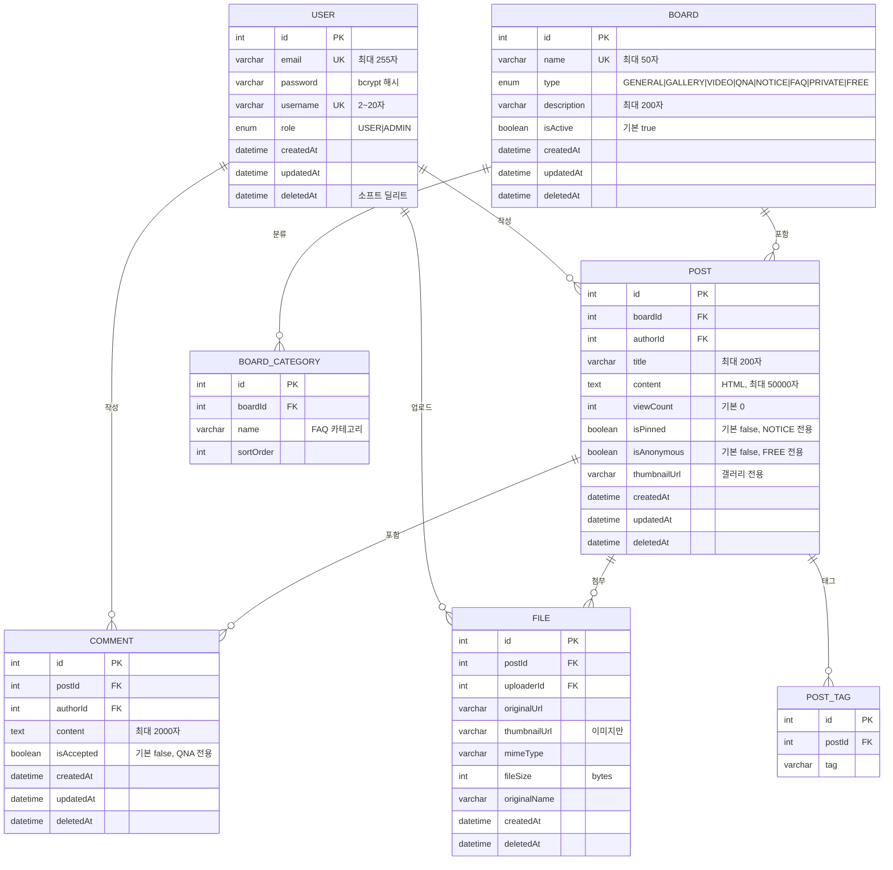
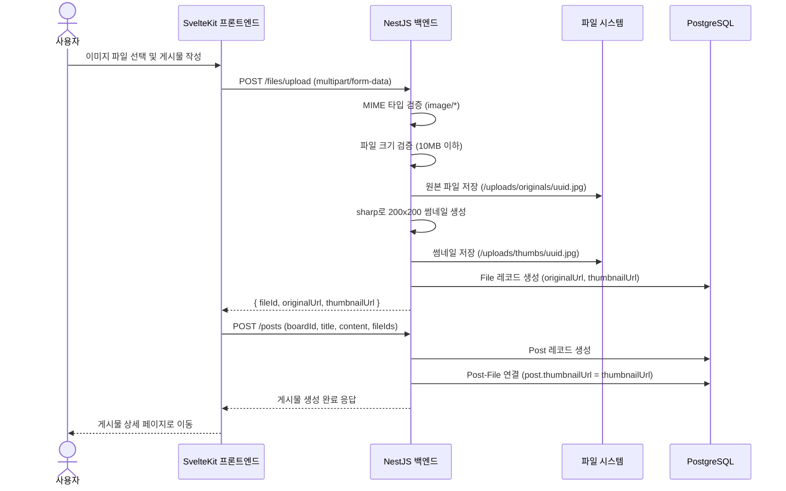

# 09. 에이전트 친화적 분석/설계서 작성법 — ERD·API 명세·유스케이스 완성

<!-- R5 수정: 2026-06-06 웹검색 기반 검증 완료. 검증 결과 이상 없음. ERD/OpenAPI/시퀀스 다이어그램 방법론 공식 문서와 일치 확인 -->

> **학습 목표**
> - 에이전트가 설계서를 파싱하는 방식을 이해한다
> - Mermaid로 ERD를 작성하고 Codex가 Prisma 스키마로 변환하게 한다
> - API 명세서를 OpenAPI(Swagger) 형식으로 작성한다
> - 유스케이스와 시퀀스 다이어그램으로 플로우를 명확히 한다
> - docs/ 폴더 구조를 표준화하고 AGENTS.md에서 참조를 설정한다

---

## 1. 에이전트가 설계서를 파싱하는 방식

Codex는 자연어와 구조화된 텍스트를 모두 이해한다. 그러나 **구조화된 설계서가 자연어 설명보다 훨씬 정확한 구현**을 만든다.

### 1.1 파싱 정확도 비교

```
[자연어 설명]
"사용자 테이블은 이메일, 비밀번호, 이름을 저장하고,
 게시물과 1:N 관계다"

→ Codex가 생성할 수 있는 스키마 (모호함):
model User {
  id       Int     @id @default(autoincrement())
  email    String  @unique
  password String
  name     String
  posts    Post[]
}
// 문제: createdAt, updatedAt, deletedAt, role, username 등 누락 가능

[Mermaid ERD]
erDiagram
  USER {
    int id PK
    string email UK "최대 255자, 이메일 형식"
    string password "bcrypt 해시"
    string username UK "2~20자"
    enum role "USER|ADMIN"
    datetime createdAt
    datetime updatedAt
    datetime deletedAt "소프트 딜리트"
  }

→ Codex가 생성할 스키마 (정확):
model User {
  id        Int       @id @default(autoincrement())
  email     String    @unique @db.VarChar(255)
  password  String
  username  String    @unique @db.VarChar(20)
  role      Role      @default(USER)
  createdAt DateTime  @default(now())
  updatedAt DateTime  @updatedAt
  deletedAt DateTime?
}
```

### 1.2 설계서가 코드보다 먼저다

에이전트 친화적 개발에서는 코드를 먼저 작성하지 않는다. 설계서를 먼저 작성하고, 설계서를 기반으로 코드를 생성한다.

```
아이디어
  ↓
PRD (기능 요구사항)
  ↓
ERD (데이터 설계)
  ↓
API 명세서 (인터페이스 설계)
  ↓
Codex 구현 태스크
  ↓
코드 (자동 생성)
```

---

## 2. Mermaid ERD 작성

Mermaid는 마크다운 내에 다이어그램을 코드로 작성하는 도구다. GitHub에서 바로 렌더링되어 별도 다이어그램 툴이 필요 없다.

### 2.1 Mermaid ERD 기본 문법

```mermaid
erDiagram
  엔티티명 {
    타입 필드명 속성 "주석"
  }
  엔티티A ||--o{ 엔티티B : "관계명"
```

관계 기호:
```
||    정확히 하나 (일대일)
|o    하나 또는 없음
{|    하나 이상 (일대다)
{o    없음 이상 (영대다)
o|    하나 또는 없음
```

### 2.2 board-hub 전체 ERD

```markdown
## board-hub ERD


```

### 2.3 ERD 작성 원칙

**원칙 1: 모든 엔티티에 id PK를 명시한다**
```
USER {
  int id PK
  ...
}
```

**원칙 2: FK 관계를 명시한다**
```
POST {
  int boardId FK  ← BOARD의 id를 참조
  int authorId FK ← USER의 id를 참조
}
```

**원칙 3: 타입과 제약조건을 주석으로 명시한다**
```
USER {
  varchar email UK "최대 255자, 이메일 형식"
  varchar password "bcrypt 해시, 평문 저장 금지"
  enum role "USER|ADMIN, 기본 USER"
}
```

**원칙 4: Soft Delete 필드를 명시한다**
```
USER {
  datetime deletedAt "소프트 딜리트, NULL이면 활성"
}
```

---

## 3. API 명세서 작성

### 3.1 OpenAPI 형식 (YAML)

OpenAPI(Swagger) 형식으로 API 명세를 작성하면 Codex가 정확하게 파싱하고, 추후 자동 문서 생성도 가능하다.

**docs/API.yaml**:

```yaml
openapi: 3.0.3
info:
  title: Board Hub API
  version: 1.0.0
  description: 멀티 게시판 허브 REST API

servers:
  - url: http://localhost:3000/api/v1
    description: 개발 서버
  - url: https://api.board-hub.com/api/v1
    description: 프로덕션 서버

components:
  securitySchemes:
    cookieAuth:
      type: apiKey
      in: cookie
      name: access_token

  schemas:
    User:
      type: object
      properties:
        id:
          type: integer
        email:
          type: string
          format: email
        username:
          type: string
          minLength: 2
          maxLength: 20
        role:
          type: string
          enum: [USER, ADMIN]
        createdAt:
          type: string
          format: date-time

    Post:
      type: object
      properties:
        id:
          type: integer
        title:
          type: string
          maxLength: 200
        content:
          type: string
          maxLength: 50000
        boardId:
          type: integer
        author:
          $ref: '#/components/schemas/User'
        viewCount:
          type: integer
        commentCount:
          type: integer
        isPinned:
          type: boolean
        isAnonymous:
          type: boolean
        thumbnailUrl:
          type: string
          nullable: true
        createdAt:
          type: string
          format: date-time

    Error:
      type: object
      required: [message]
      properties:
        message:
          type: string
        statusCode:
          type: integer
        error:
          type: string

paths:
  /auth/register:
    post:
      summary: 회원가입
      operationId: register
      tags: [Auth]
      requestBody:
        required: true
        content:
          application/json:
            schema:
              type: object
              required: [email, password, username]
              properties:
                email:
                  type: string
                  format: email
                  maxLength: 255
                password:
                  type: string
                  minLength: 8
                  description: 대소문자+숫자+특수문자 포함
                username:
                  type: string
                  minLength: 2
                  maxLength: 20
      responses:
        '201':
          description: 회원가입 성공
          content:
            application/json:
              schema:
                type: object
                properties:
                  message:
                    type: string
                  user:
                    $ref: '#/components/schemas/User'
        '400':
          description: 입력값 오류
          content:
            application/json:
              schema:
                $ref: '#/components/schemas/Error'
        '409':
          description: 이메일 또는 사용자명 중복
          content:
            application/json:
              schema:
                $ref: '#/components/schemas/Error'

  /auth/login:
    post:
      summary: 로그인
      operationId: login
      tags: [Auth]
      requestBody:
        required: true
        content:
          application/json:
            schema:
              type: object
              required: [email, password]
              properties:
                email:
                  type: string
                  format: email
                password:
                  type: string
      responses:
        '200':
          description: 로그인 성공
          headers:
            Set-Cookie:
              description: access_token JWT (HttpOnly, Secure)
              schema:
                type: string
          content:
            application/json:
              schema:
                type: object
                properties:
                  message:
                    type: string
                  user:
                    $ref: '#/components/schemas/User'
        '401':
          description: 자격증명 오류
        '429':
          description: 로그인 시도 횟수 초과

  /boards/{boardId}/posts:
    get:
      summary: 게시물 목록 조회
      operationId: getPosts
      tags: [Posts]
      parameters:
        - name: boardId
          in: path
          required: true
          schema:
            type: integer
        - name: page
          in: query
          schema:
            type: integer
            default: 1
            minimum: 1
        - name: limit
          in: query
          schema:
            type: integer
            default: 20
            minimum: 1
            maximum: 100
        - name: sort
          in: query
          schema:
            type: string
            enum: [createdAt, viewCount]
            default: createdAt
      responses:
        '200':
          description: 게시물 목록
          content:
            application/json:
              schema:
                type: object
                properties:
                  posts:
                    type: array
                    items:
                      $ref: '#/components/schemas/Post'
                  pagination:
                    type: object
                    properties:
                      page:
                        type: integer
                      limit:
                        type: integer
                      total:
                        type: integer
                      totalPages:
                        type: integer
```

### 3.2 Markdown 형식 API 명세서

YAML이 익숙하지 않다면 Markdown 형식도 유효하다.

**docs/API.md**:

```markdown
# Board Hub API 명세서

## 기본 정보
- Base URL: /api/v1
- 인증 방식: HttpOnly 쿠키 (access_token)
- Content-Type: application/json (파일 업로드 제외)

## 공통 오류 응답 형식
```json
{
  "message": "오류 메시지",
  "statusCode": 400,
  "error": "Bad Request"
}
```

---

## 인증 (Auth)

### POST /auth/register — 회원가입

**요청**
```json
{
  "email": "string (이메일, 최대 255자)",
  "password": "string (8자 이상, 복잡도 규칙 적용)",
  "username": "string (2~20자)"
}
```

**응답 201**
```json
{
  "message": "회원가입이 완료되었습니다",
  "user": {
    "id": 1,
    "email": "user@example.com",
    "username": "홍길동",
    "role": "USER",
    "createdAt": "ISO 8601 날짜"
  }
}
```

**오류**
| 코드 | 조건 | 메시지 |
|------|------|--------|
| 400 | 이메일 형식 오류 | "올바른 이메일 형식이 아닙니다" |
| 400 | 비밀번호 규칙 미충족 | "비밀번호는 8자 이상..." |
| 409 | 이메일 중복 | "이미 사용 중인 이메일입니다" |
| 409 | 사용자명 중복 | "이미 사용 중인 사용자명입니다" |
```

---

## 4. 유스케이스 명세서

### 4.1 유스케이스 작성 형식

```markdown
## UC-001: 이메일 로그인

**액터**: 비로그인 사용자
**목적**: 이메일과 비밀번호로 시스템에 로그인한다
**전제 조건**: 이미 회원가입이 완료된 계정이 존재한다

**기본 흐름**
1. 사용자가 이메일과 비밀번호를 입력하고 로그인 버튼을 클릭한다
2. 시스템이 이메일 존재 여부를 확인한다
3. 시스템이 비밀번호를 bcrypt로 검증한다
4. 시스템이 JWT를 생성하고 HttpOnly 쿠키에 저장한다
5. 사용자가 게시판 목록 페이지로 리다이렉트된다

**대안 흐름**
2a. 이메일이 존재하지 않는 경우
    → 401 "이메일 또는 비밀번호가 올바르지 않습니다"
3a. 비밀번호가 일치하지 않는 경우
    → 401 "이메일 또는 비밀번호가 올바르지 않습니다"
5a. 5회 연속 실패 시
    → 429 "5분 후 다시 시도해주세요"

**사후 조건**: 사용자가 로그인 상태로 전환되며 JWT 쿠키가 설정된다
**성능**: 2초 이내
```

### 4.2 시퀀스 다이어그램 (Mermaid)

```markdown
## 시퀀스 다이어그램: 이미지 업로드 및 썸네일 생성


```

---

## 5. docs/ 폴더 구조 표준

```
board-hub/
└── docs/
    ├── README.md              # 문서 목록 및 개요
    ├── PRD.md                 # 제품 요구사항 문서 (08편 작성)
    ├── ERD.md                 # 데이터베이스 설계 (Mermaid ERD)
    ├── API.md                 # API 명세서 (Markdown)
    ├── API.yaml               # API 명세서 (OpenAPI)
    ├── USECASE.md             # 유스케이스 명세서
    ├── SEQUENCE.md            # 시퀀스 다이어그램
    ├── ARCHITECTURE.md        # 시스템 아키텍처
    └── DECISIONS.md           # 기술 결정 기록 (ADR)
```

**docs/README.md**:

```markdown
# Board Hub 문서

## 문서 목록

| 문서 | 설명 | 최종 수정 |
|------|------|----------|
| PRD.md | 제품 요구사항 (기능 명세) | 2025-06-05 |
| ERD.md | 데이터베이스 설계 | 2025-06-05 |
| API.md | REST API 명세서 | 2025-06-05 |
| USECASE.md | 유스케이스 다이어그램 | 2025-06-05 |
| SEQUENCE.md | 주요 기능 시퀀스 다이어그램 | 2025-06-05 |

## Codex 에이전트 참조 순서

1. AGENTS.md (규칙)
2. docs/PRD.md (기능 요구사항)
3. docs/ERD.md (데이터 설계)
4. docs/API.md (API 스펙)
5. 서브 AGENTS.md (각 앱별 규칙)
```

---

## 6. AGENTS.md에서 설계서 참조 설정

<!-- R4 수정: AGENTS.md Best Practice 원칙 추가 - 모든 라인은 에이전트에게 구체적 행동/금지 사항 지시 -->
> **AGENTS.md 작성 원칙 (공식 Best Practice)**
> "모든 라인은 에이전트에게 **구체적인 행동** 또는 **금지 사항**을 지시해야 한다."
> 일반적인 설명이나 배경 지식보다, 에이전트가 바로 실행할 수 있는 명령어나 규칙을 중심으로 작성한다.
>
> - ❌ 나쁜 예: "TypeScript를 사용하는 프로젝트입니다."
> - ✅ 좋은 예: "TypeScript strict 모드로 작성하고, `any` 타입 사용을 금지한다."

```markdown
## 설계 문서 참조 (AGENTS.md)

기능을 구현하기 전에 반드시 다음 순서로 문서를 참조한다:

1. docs/PRD.md: 구현할 기능의 요구사항 확인
   - 기능 ID로 검색 (예: AUTH-001)
   - 성공/실패 케이스 확인

2. docs/ERD.md: 관련 데이터 모델 확인
   - 사용할 테이블과 컬럼 확인
   - FK 관계 확인

3. docs/API.md: API 스펙 확인
   - 요청/응답 형식 확인
   - 오류 응답 코드 확인

4. docs/SEQUENCE.md: 복잡한 플로우 확인 (필요한 경우)

### 구현 우선순위
PRD.md의 우선순위 (P0 > P1 > P2)를 따른다.
P0 기능이 모두 완성되기 전에 P1, P2를 구현하지 않는다.

### 문서와 코드 불일치
문서와 기존 코드가 불일치하는 경우:
- 문서가 더 최신이면 문서를 따른다
- 확신이 없으면 태스크 로그에 불일치 사항을 보고하고 보수적으로 구현한다
```

---

## 7. 설계서 기반 Prisma 스키마 생성

### 7.1 Codex 태스크: ERD → Prisma 스키마

```
"docs/ERD.md의 Mermaid ERD를 읽고
prisma/schema.prisma 파일을 완성해줘.

[요구사항]
1. ERD의 모든 엔티티를 Prisma 모델로 변환
2. 관계: 1:N은 @relation 사용, 다중 FK 명시
3. Enum 타입 정의 포함 (BoardType, Role)
4. Soft Delete: deletedAt DateTime? 필드 포함
5. 타임스탬프: createdAt @default(now()), updatedAt @updatedAt
6. 인덱스: @unique, @@index 적절히 추가
7. postgresql datasource 설정

[마이그레이션]
스키마 완성 후 pnpm prisma migrate dev --name init 실행

[검증]
- pnpm prisma validate 성공
- pnpm prisma generate 성공
- 빌드 성공"
```

### 7.2 생성될 schema.prisma 예시

```prisma
// prisma/schema.prisma

generator client {
  provider = "prisma-client-js"
}

datasource db {
  provider = "postgresql"
  url      = env("DATABASE_URL")
}

// Enums
enum Role {
  USER
  ADMIN
}

enum BoardType {
  GENERAL
  GALLERY
  VIDEO
  QNA
  NOTICE
  FAQ
  PRIVATE
  FREE
}

// Models
model User {
  id        Int       @id @default(autoincrement())
  email     String    @unique @db.VarChar(255)
  password  String
  username  String    @unique @db.VarChar(20)
  role      Role      @default(USER)
  createdAt DateTime  @default(now())
  updatedAt DateTime  @updatedAt
  deletedAt DateTime?

  posts    Post[]
  comments Comment[]
  files    File[]

  @@index([email])
  @@index([deletedAt])
}

model Board {
  id          Int       @id @default(autoincrement())
  name        String    @unique @db.VarChar(50)
  type        BoardType
  description String?   @db.VarChar(200)
  isActive    Boolean   @default(true)
  createdAt   DateTime  @default(now())
  updatedAt   DateTime  @updatedAt
  deletedAt   DateTime?

  posts      Post[]
  categories BoardCategory[]

  @@index([type])
  @@index([deletedAt])
}

model Post {
  id           Int       @id @default(autoincrement())
  boardId      Int
  authorId     Int
  title        String    @db.VarChar(200)
  content      String    @db.Text
  viewCount    Int       @default(0)
  isPinned     Boolean   @default(false)
  isAnonymous  Boolean   @default(false)
  thumbnailUrl String?
  createdAt    DateTime  @default(now())
  updatedAt    DateTime  @updatedAt
  deletedAt    DateTime?

  board    Board     @relation(fields: [boardId], references: [id])
  author   User      @relation(fields: [authorId], references: [id])
  comments Comment[]
  files    File[]
  tags     PostTag[]

  @@index([boardId, deletedAt, createdAt(sort: Desc)])
  @@index([boardId, isPinned, createdAt(sort: Desc)])
  @@index([authorId])
}

model Comment {
  id         Int       @id @default(autoincrement())
  postId     Int
  authorId   Int
  content    String    @db.VarChar(2000)
  isAccepted Boolean   @default(false)
  createdAt  DateTime  @default(now())
  updatedAt  DateTime  @updatedAt
  deletedAt  DateTime?

  post   Post @relation(fields: [postId], references: [id])
  author User @relation(fields: [authorId], references: [id])

  @@index([postId, deletedAt])
  @@index([isAccepted])
}

model File {
  id           Int       @id @default(autoincrement())
  postId       Int?
  uploaderId   Int
  originalUrl  String
  thumbnailUrl String?
  mimeType     String
  fileSize     Int
  originalName String
  createdAt    DateTime  @default(now())
  deletedAt    DateTime?

  post     Post? @relation(fields: [postId], references: [id])
  uploader User  @relation(fields: [uploaderId], references: [id])

  @@index([postId])
  @@index([uploaderId])
}

model BoardCategory {
  id        Int    @id @default(autoincrement())
  boardId   Int
  name      String @db.VarChar(50)
  sortOrder Int    @default(0)

  board Board @relation(fields: [boardId], references: [id])

  @@index([boardId])
}

model PostTag {
  id     Int    @id @default(autoincrement())
  postId Int
  tag    String @db.VarChar(30)

  post Post @relation(fields: [postId], references: [id])

  @@index([postId])
  @@index([tag])
}
```

---

## 8. 설계서 완성도 체크리스트

```
ERD 체크리스트
[ ] 01. 모든 엔티티에 PK(id)가 명시되어 있다
[ ] 02. FK 관계가 모두 표시되어 있다
[ ] 03. 모든 필드에 타입이 명시되어 있다 (string, int, datetime 등)
[ ] 04. Unique 제약조건이 표시되어 있다 (UK)
[ ] 05. Enum 필드의 가능한 값이 주석으로 명시되어 있다
[ ] 06. Nullable/Not-Null 구분이 되어 있다
[ ] 07. Soft Delete 필드(deletedAt)가 있다
[ ] 08. 타임스탬프(createdAt, updatedAt)가 있다
[ ] 09. 성능을 위한 인덱스가 명시되어 있다
[ ] 10. 엔티티 간 관계가 정확하게 표현되어 있다

API 명세서 체크리스트
[ ] 11. 모든 엔드포인트에 HTTP 메서드와 경로가 있다
[ ] 12. 요청 Body가 타입과 함께 명시되어 있다
[ ] 13. 성공 응답 Body가 예시와 함께 있다
[ ] 14. 실패 케이스가 상태 코드와 함께 있다
[ ] 15. 인증 요구사항이 명시되어 있다 (불필요/필요/ADMIN)
[ ] 16. 쿼리 파라미터가 명시되어 있다 (page, limit 등)
[ ] 17. 응답 헤더가 명시되어 있다 (Set-Cookie 등)

유스케이스 체크리스트
[ ] 18. 주요 기능의 유스케이스가 정의되어 있다
[ ] 19. 대안 흐름(예외 처리)이 포함되어 있다
[ ] 20. 시퀀스 다이어그램으로 복잡한 플로우가 시각화되어 있다
```

---

## 9. GitHub Wiki vs docs/ 폴더 선택 기준

```
┌─────────────────────┬──────────────────┬──────────────────┐
│       항목           │   GitHub Wiki    │   docs/ 폴더     │
├─────────────────────┼──────────────────┼──────────────────┤
│ Codex 접근          │ ❌ 접근 불가      │ ✅ 레포 내 파일  │
│ 버전 관리           │ 별도 레포         │ ✅ 코드와 함께   │
│ PR 리뷰             │ ❌              │ ✅ 설계 변경도 리뷰│
│ 검색               │ GitHub Wiki 검색  │ 코드 검색과 통합  │
│ Mermaid 렌더링      │ ✅              │ ✅ (GitHub에서)   │
└─────────────────────┴──────────────────┴──────────────────┘

결론: Codex가 참조해야 하는 설계서는 반드시 docs/ 폴더에 배치한다.
```

---

## 10. 실습: docs/ 폴더 완성 및 Push

```bash
# 1. docs 폴더 생성
mkdir -p docs

# 2. 각 파일 작성
touch docs/README.md
touch docs/PRD.md      # 08편 내용
touch docs/ERD.md      # 이번 편 ERD 내용
touch docs/API.md      # 이번 편 API 명세 내용
touch docs/USECASE.md  # 유스케이스 내용
touch docs/SEQUENCE.md # 시퀀스 다이어그램

# 3. Git 추가 및 커밋
git add docs/
git commit -m "docs: add design documents (ERD, API spec, use cases)"
git push origin main
```

Push 후 Codex 태스크:
```
"docs/ERD.md를 읽고 prisma/schema.prisma를 완성해줘.
모든 모델, 관계, 인덱스, Enum을 포함해줘.
마이그레이션 파일도 생성해줘."
```

---

> **한줄 요약**
> ERD는 Mermaid로 필드 타입·제약조건·관계를 명시하고, API 명세는 요청/응답/오류를 JSON 예시와 함께 작성하며, docs/ 폴더에 배치하고 AGENTS.md에서 참조를 설정하면 Codex가 설계서 기반으로 정확한 코드를 생성한다.
