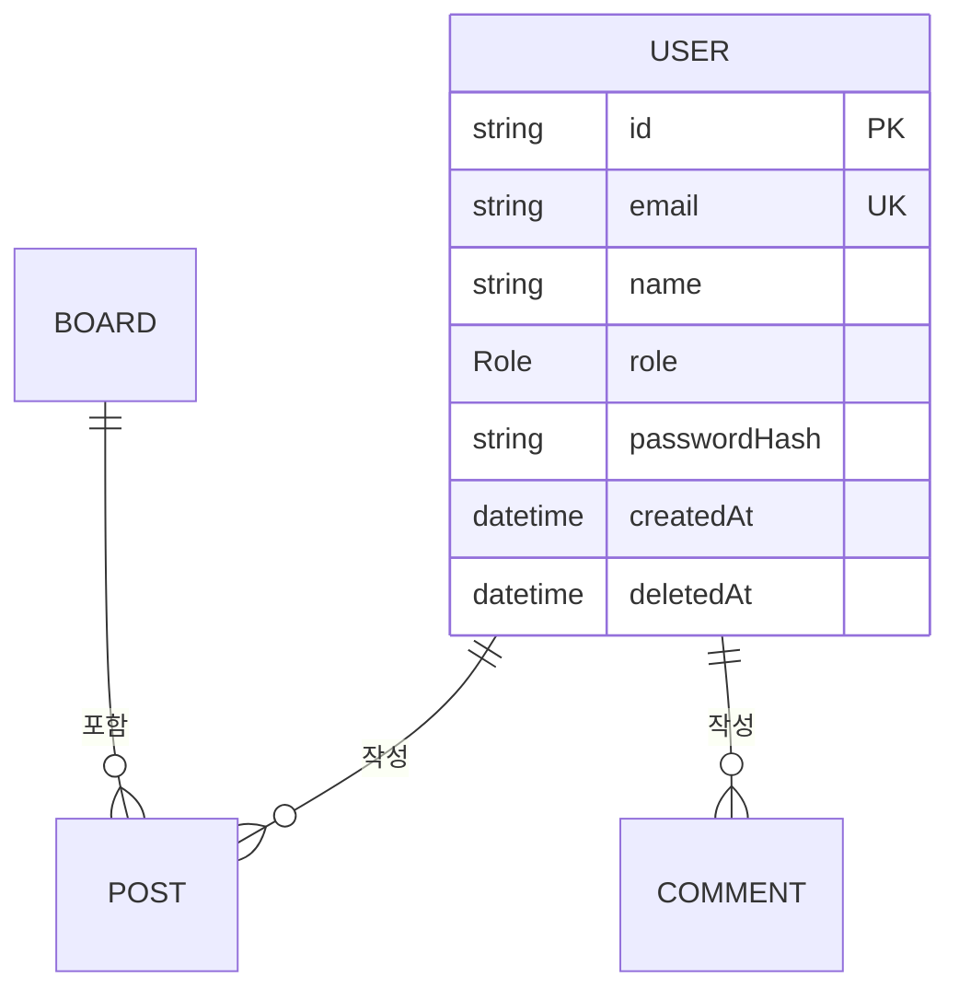
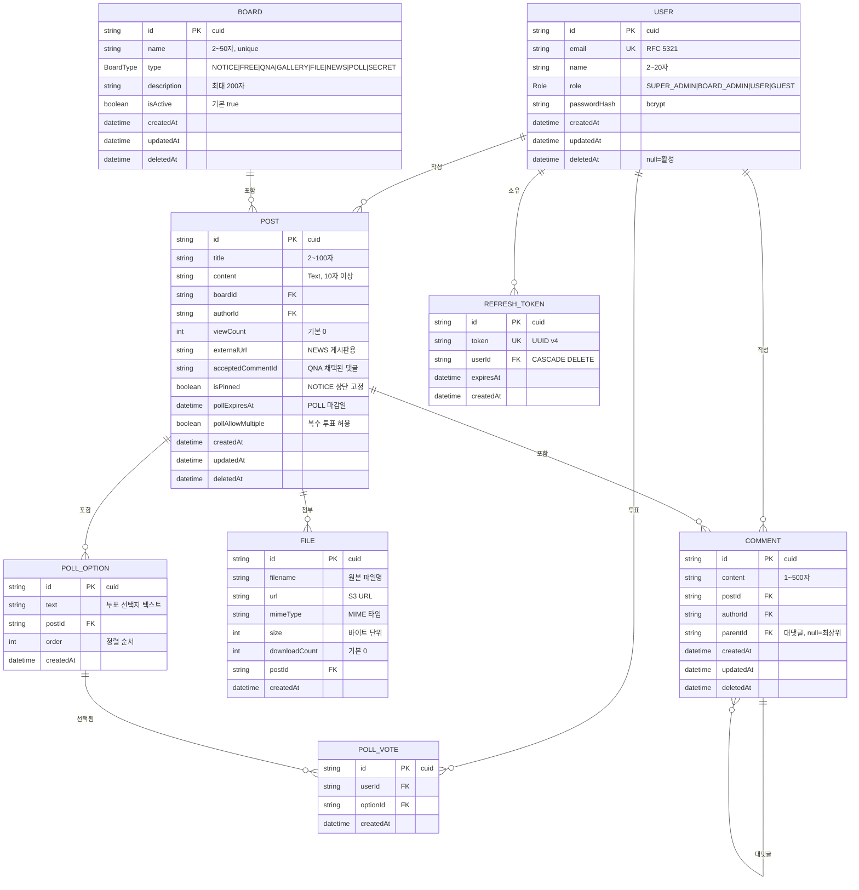
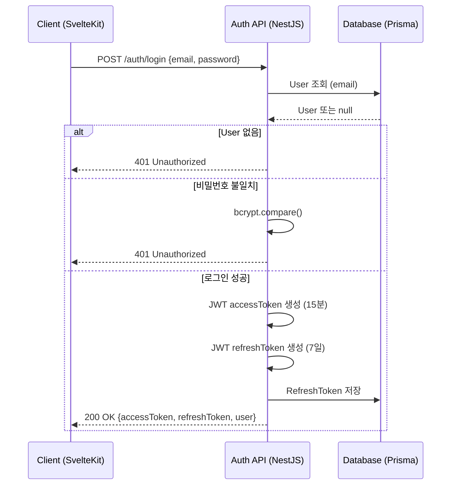
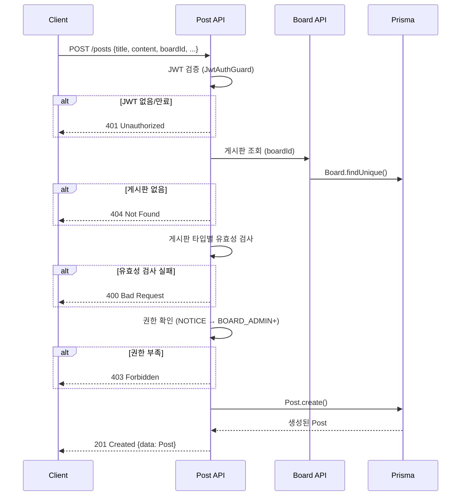
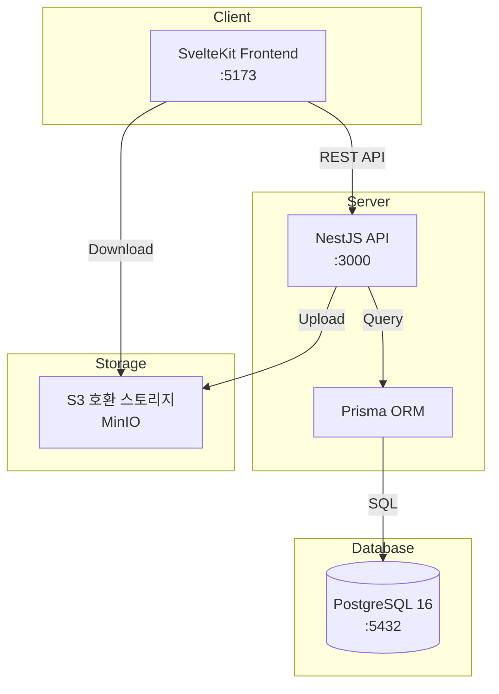

# 10. 에이전트 친화적 분석/설계서 작성법

> **학습 목표**
> - AI 에이전트가 설계 문서를 읽고 코드를 생성하는 방식을 이해한다
> - Mermaid erDiagram으로 멀티 게시판 전체 ERD를 작성한다
> - API 명세서를 JSON 스키마로 작성한다
> - docs/ 폴더 구조를 표준화하고 @Docs에 등록한다

---

## 1. 에이전트가 설계서를 읽는 방식

### 1.1 왜 설계서가 중요한가

Agent에게 단순히 "게시판 만들어줘"라고 하면 AI가 임의로 설계한다. 이렇게 생성된 코드는 팀의 기존 컨벤션과 다를 수 있고, 나중에 수정하기 어렵다.

설계서가 있으면 Agent는 설계서를 "정답"으로 삼아 코드를 생성한다.

```
설계서 없이:
Agent → 임의 설계 → 코드 생성 → 수정 반복 (시간 낭비)

설계서 있이:
설계서 → Agent 참조 → 설계서 기반 코드 생성 → 검토만 하면 됨
```

### 1.2 에이전트가 선호하는 설계서 형식

```
✓ 에이전트 친화적:
- Mermaid 다이어그램 (코드로 표현된 다이어그램)
- JSON Schema (정확한 타입 정의)
- 마크다운 테이블 (관계 명시)
- 코드 스니펫 (패턴 예시)

✗ 에이전트 비친화적:
- PNG/JPG 이미지로만 된 ERD (텍스트 추출 불가)
- 자연어 설명만 있는 API 명세
- 모호한 관계 표현 ("연결됩니다")
```

---

## 2. ERD 작성 (Mermaid erDiagram)

### 2.1 Mermaid erDiagram 문법

```markdown

```

### 2.2 멀티 게시판 허브 전체 ERD

```markdown

```

### 2.3 ERD에 포함해야 할 것

```
필수:
✓ 모든 테이블 (엔티티)
✓ 모든 컬럼과 타입
✓ PK (Primary Key)
✓ FK (Foreign Key)와 참조 관계
✓ UK (Unique Key)
✓ 기본값
✓ NULL 허용 여부 (주석으로 명시)
✓ 관계 카디널리티 (||, |o, o{, }|)

권장:
✓ 인덱스 컬럼 표시
✓ 비즈니스 규칙 주석 ("bcrypt", "UUID v4" 등)
```

---

## 3. API 명세서 작성

### 3.1 API 명세 구조

각 엔드포인트에 다음 정보를 포함한다.

```markdown
### POST /api/v1/auth/login

**설명**: 이메일/비밀번호로 로그인하여 JWT 토큰을 발급한다

**인증**: 불필요

**요청**:
```json
{
  "email": "user@example.com",
  "password": "Password123!"
}
```

**요청 스키마**:
```typescript
interface LoginDto {
  email: string;  // RFC 5321 형식
  password: string;  // 8~20자
}
```

**성공 응답** (HTTP 200):
```json
{
  "data": {
    "accessToken": "eyJhbGciOiJIUzI1NiIsInR5cCI6IkpXVCJ9...",
    "refreshToken": "eyJhbGciOiJIUzI1NiIsInR5cCI6IkpXVCJ9...",
    "user": {
      "id": "clx1234567890",
      "email": "user@example.com",
      "name": "홍길동",
      "role": "USER"
    }
  }
}
```

**에러 응답**:
| 상태 코드 | 조건 |
|-----------|------|
| 400 | 요청 형식 오류 |
| 401 | 이메일 없음 또는 비밀번호 불일치 |
| 429 | 분당 10회 초과 |
```

### 3.2 멀티 게시판 핵심 API 명세

```markdown
## 인증 API

### POST /api/v1/auth/register
**요청 스키마**:
```typescript
interface RegisterDto {
  email: string;      // RFC 5321 형식, unique
  password: string;   // 8~20자, 영문+숫자+특수문자 조합
  name: string;       // 2~20자
}
```

**성공 응답** (HTTP 201):
```json
{
  "data": {
    "id": "clx...",
    "email": "user@example.com",
    "name": "홍길동",
    "role": "USER",
    "createdAt": "2026-01-01T00:00:00.000Z"
  }
}
```

**에러**: 409 (이메일 중복), 400 (유효성 검사 실패)

---

## 게시글 API

### GET /api/v1/boards/:boardId/posts

**인증**: 불필요 (SECRET 게시판은 USER 필요)

**쿼리 파라미터**:
```typescript
interface PostListQuery {
  page?: number;    // 기본 1
  limit?: number;   // 기본 20, 최대 100
  search?: string;  // 제목+내용 검색
}
```

**성공 응답** (HTTP 200):
```json
{
  "data": [
    {
      "id": "clx...",
      "title": "첫 번째 게시글",
      "createdAt": "2026-01-01T00:00:00.000Z",
      "viewCount": 42,
      "author": { "id": "clx...", "name": "홍길동" },
      "_count": { "comments": 5 }
    }
  ],
  "meta": {
    "page": 1,
    "limit": 20,
    "total": 100,
    "totalPages": 5
  }
}
```

---

### POST /api/v1/posts (게시글 작성)

**인증**: USER+ (NOTICE/NEWS는 BOARD_ADMIN+)

**요청 스키마 (게시판 타입별)**:
```typescript
// 공통
interface BaseCreatePostDto {
  boardId: string;    // UUID
  title: string;      // 2~100자
  content: string;    // 10자 이상
}

// GALLERY 추가 필드
interface GalleryPostDto extends BaseCreatePostDto {
  imageUrls: string[];  // 1~10개, URL 형식
}

// FILE 추가 필드
interface FilePostDto extends BaseCreatePostDto {
  fileUrls: string[];   // 1~5개, URL 형식
}

// NEWS 추가 필드
interface NewsPostDto extends BaseCreatePostDto {
  externalUrl: string;  // URL 형식, 필수
}

// POLL 추가 필드
interface PollPostDto extends BaseCreatePostDto {
  pollOptions: string[];  // 2~10개 선택지
  pollAllowMultiple: boolean;
  pollExpiresAt?: string;  // ISO 8601
}
```
```

---

## 4. 유스케이스 명세서

### 4.1 주요 유스케이스 다이어그램

```markdown

```

### 4.2 게시글 작성 유스케이스

```markdown

```

---

## 5. docs/ 폴더 구조 표준

### 5.1 표준 폴더 구조

```
multi-board-hub/
└── docs/
    ├── prd.md              # 요구사항 정의서 (09편에서 작성)
    ├── erd.md              # Entity Relationship Diagram
    ├── api.md              # API 명세서
    ├── architecture.md     # 시스템 아키텍처
    ├── sequence/           # 시퀀스 다이어그램
    │   ├── auth-flow.md
    │   ├── post-create.md
    │   └── file-upload.md
    └── decisions/          # 아키텍처 결정 기록 (ADR)
        ├── 001-use-jwt.md
        ├── 002-use-prisma.md
        └── 003-soft-delete.md
```

### 5.2 아키텍처 문서 작성

```markdown
# architecture.md

## 시스템 구성도



## 데이터 흐름
1. SvelteKit → NestJS: REST API (JSON)
2. NestJS → PostgreSQL: Prisma ORM (자동 SQL 생성)
3. NestJS → S3: 파일 스트림
4. SvelteKit → S3: 파일 직접 다운로드 (Presigned URL)
```

---

## 6. @Docs에 설계서 등록

### 6.1 설계서를 항상 참조하도록 설정

```markdown
# .cursor/rules에 추가

## 설계 문서 (항상 참조)
구현 전에 다음 문서를 반드시 확인한다:
- @Docs docs/prd.md    → 기능 요구사항
- @Docs docs/erd.md    → 데이터 구조
- @Docs docs/api.md    → API 명세

## 구현 순서
1. PRD에서 기능 ID 확인 ([BOARD-001] 등)
2. ERD에서 관련 엔티티 구조 확인
3. API 명세에서 요청/응답 형식 확인
4. 기존 코드 패턴 참조 (@Files)
5. 코드 생성
```

### 6.2 Chat에서 설계서 기반 지시

```
효과적인 지시 예시:

"@Docs docs/prd.md
@Docs docs/erd.md
PRD의 [POST-003] 요구사항을 ERD 구조에 맞게 구현해줘.
boardId에 따라 다른 유효성 검사를 적용해야 해."

"@Docs docs/api.md
@Files apps/backend/src/post/
API 명세의 /api/v1/posts POST 엔드포인트를 구현해줘.
요청/응답 스키마를 정확히 따라줘."
```

---

## 7. 설계서 완성도 체크리스트

```
ERD 완성도:
[ ] 모든 테이블과 컬럼이 Mermaid erDiagram으로 표현되어 있다
[ ] PK, FK, UK가 명시되어 있다
[ ] 관계 카디널리티가 올바르다
[ ] 기본값, NULL 여부가 표시되어 있다
[ ] 인덱스 컬럼이 명시되어 있다
[ ] 소프트 삭제 컬럼(deletedAt)이 모든 테이블에 있다

API 명세 완성도:
[ ] 모든 엔드포인트가 명세에 있다
[ ] 요청/응답 타입이 TypeScript interface로 정의되어 있다
[ ] 예시 JSON이 포함되어 있다
[ ] 에러 케이스별 상태 코드가 있다
[ ] 인증 요구사항이 명시되어 있다

유스케이스 완성도:
[ ] 주요 플로우의 시퀀스 다이어그램이 있다
[ ] 예외 경로가 다이어그램에 포함되어 있다

Cursor 통합:
[ ] docs/ 폴더가 .cursor/rules에 @Docs로 등록되어 있다
[ ] Agent가 @Docs docs/prd.md를 참조해서 올바른 코드를 생성하는가 (검증)
```

---

## 체크리스트: 10편 학습 완료 확인

- [ ] Mermaid erDiagram 문법을 이해하고 사용할 수 있다
- [ ] 멀티 게시판 허브 전체 ERD를 docs/erd.md에 작성했다
- [ ] API 명세서를 TypeScript 인터페이스와 JSON 예시로 작성했다
- [ ] 주요 플로우의 시퀀스 다이어그램을 작성했다
- [ ] docs/ 폴더 구조를 표준에 맞게 생성했다
- [ ] .cursor/rules에 docs/ 참조를 등록했다
- [ ] Agent가 docs/ 참조로 올바른 코드를 생성하는지 검증했다

---

> **한줄 요약**
> 에이전트 친화적 설계서는 Mermaid 다이어그램과 TypeScript 타입으로 작성하여 docs/ 폴더에 관리하고 @Docs로 등록하면, Agent가 설계서를 "정답"으로 삼아 일관된 코드를 생성한다.
