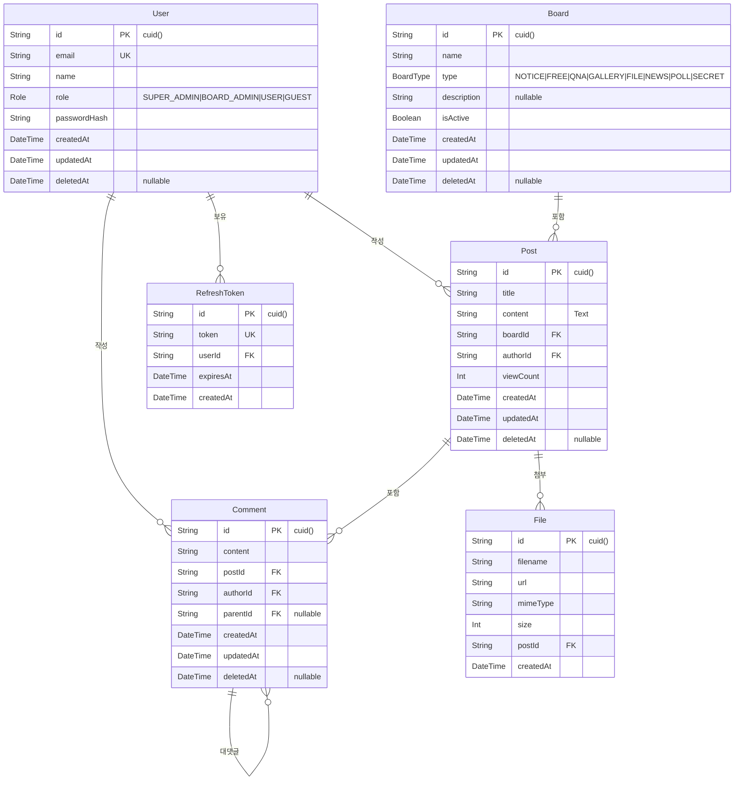
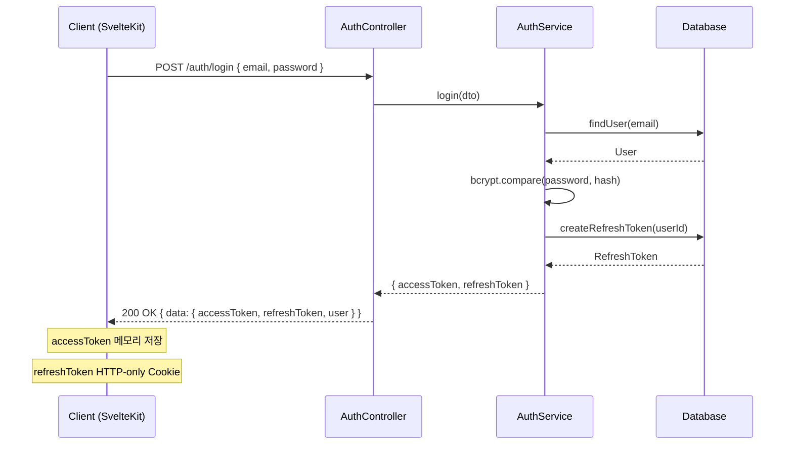

> **R6 수정**: R5 검증 결과 수정 사항 없음 (WHI 0.02). R5 내용 그대로 유지.

<!-- R6 수정: 2026-06-06 R5 검증보고서 반영 — 수정 사항 없음, WHI 0.02 -->

# 10. 에이전트 친화적 분석/설계서 작성법

> **학습 목표**
> - ERD, 시퀀스 다이어그램, API 명세서를 에이전트 친화적으로 작성하는 방법을 익힌다
> - Mermaid 다이어그램으로 AI가 이해할 수 있는 시각적 설계서를 만든다
> - @Docs로 설계서를 AI에게 등록하여 코드 생성 정확도를 높인다
> - 멀티 게시판 허브의 완성형 ERD와 API 명세서를 작성한다

---

## 1. 에이전트 친화적 설계서란

### 1.1 AI가 이해하는 설계서의 특징

```
일반 설계서:
- Word 문서 + 이미지 파일
- AI가 이미지 속 다이어그램을 파싱하기 어려움
- 변경 시 이미지 재생성 필요

에이전트 친화적 설계서:
- Markdown + Mermaid (텍스트 기반 다이어그램)
- AI가 직접 파싱하여 코드 생성
- Git으로 버전 관리 가능
- @Docs로 AI에게 즉시 제공 가능
```

---

## 2. ERD (Entity Relationship Diagram)

### 2.1 Mermaid erDiagram 형식

```markdown
# docs/erd.md


```

---

## 3. API 명세서 (OpenAPI/Swagger 친화적 형식)

### 3.1 에이전트 친화적 API 명세 형식

```markdown
# docs/api.md

## 인증 API

### POST /api/v1/auth/register
**설명**: 회원가입

**Request Body**:
```json
{
  "email": "user@example.com",  // string, required, email format
  "password": "Pass1234!",       // string, required, min:8, 영문+숫자+특수문자
  "name": "홍길동"               // string, required, min:2, max:20
}
```

**Response 201**:
```json
{
  "data": {
    "id": "clx...",
    "email": "user@example.com",
    "name": "홍길동",
    "role": "USER"
  }
}
```

**Errors**:
- 400: 유효성 검사 실패 (email 형식, password 강도, name 길이)
- 409: 이미 존재하는 이메일
```

---

## 4. 시퀀스 다이어그램

### 4.1 JWT 인증 흐름

```markdown

```

---

## 5. @Docs로 설계서 AI에게 등록

### 5.1 등록 방법

```
Cursor Settings → Features → Docs → Add Custom Doc

등록 목록:
- docs/erd.md  (ERD)
- docs/api.md  (API 명세)
- docs/prd.md  (요구사항)
```

### 5.2 설계서 참조 Agent 지시문

```
"@Docs docs/erd.md ERD를 참조해서
Prisma 스키마를 작성해줘.
ERD의 모든 엔티티와 관계를 정확히 반영해야 해.
소프트 삭제(deletedAt)와 인덱스도 포함해줘."

"@Docs docs/api.md POST /api/v1/auth/register 명세를 참조해서
NestJS AuthController와 AuthService를 구현해줘."
```

---

## 6. Plan Mode 활용

Cursor Agent의 **Plan Mode**를 사용하면 설계서를 기반으로 구현 계획을 먼저 수립하고 검토한 후 실행할 수 있다.

```
Plan Mode 활성화:
Composer → 상단 [Plan] 버튼 클릭

활용 예:
"@Docs docs/erd.md @Docs docs/api.md
인증 모듈 구현 계획을 수립해줘.
실제로 코드를 작성하기 전에 계획만 보여줘."

→ Agent가 계획 제시
→ 개발자가 검토 후 승인
→ "이 계획대로 실행해줘"
```

---

## 체크리스트: 10편 학습 완료 확인

- [ ] Mermaid erDiagram으로 멀티 게시판 ERD를 작성했다
- [ ] 에이전트 친화적 API 명세서를 docs/api.md에 작성했다
- [ ] 시퀀스 다이어그램으로 JWT 인증 흐름을 표현했다
- [ ] @Docs로 ERD와 API 명세를 Cursor에 등록했다
- [ ] 설계서를 참조하는 Agent 지시문을 작성해봤다
- [ ] Plan Mode로 구현 계획을 검토한 후 실행해봤다

---

> **한줄 요약**
> Mermaid와 Markdown으로 작성한 에이전트 친화적 설계서를 @Docs로 AI에게 등록하면, Agent가 설계서를 직접 참조하여 구조·타입·관계를 정확히 반영한 코드를 자율적으로 생성한다.
